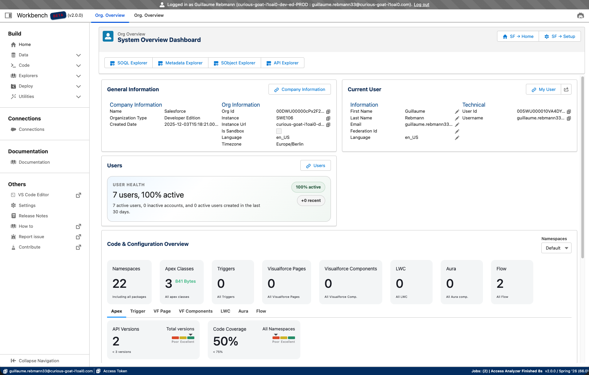
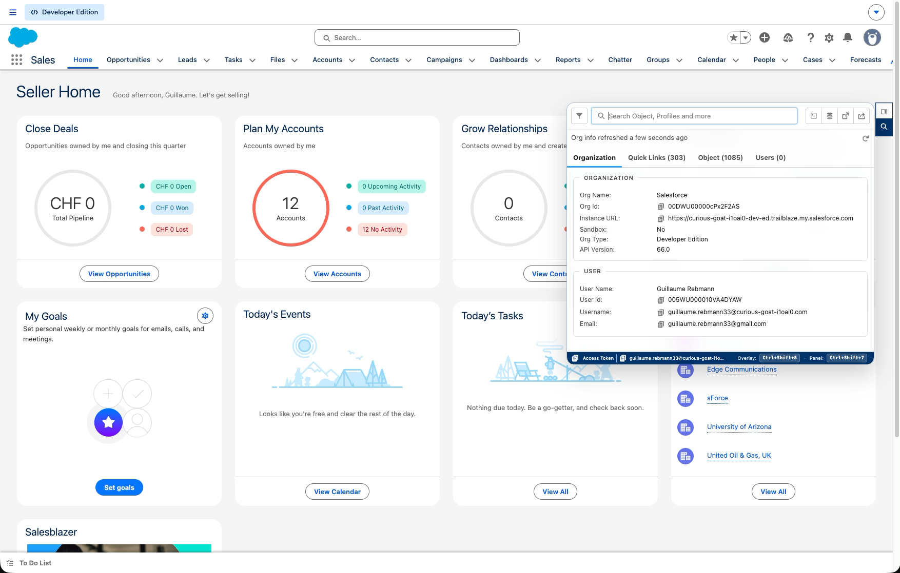
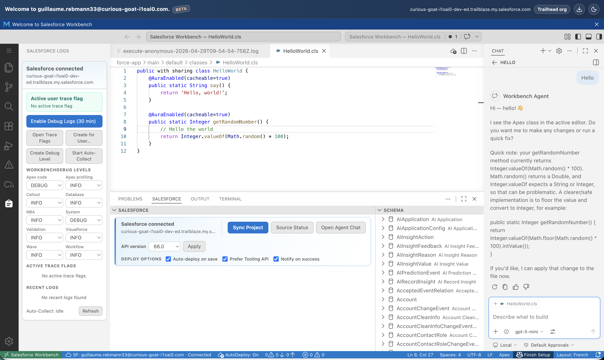
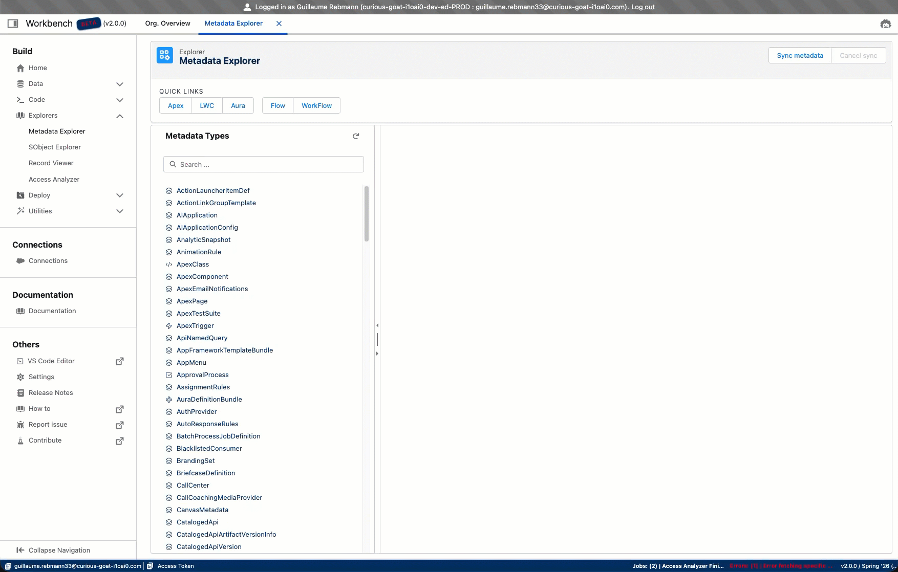
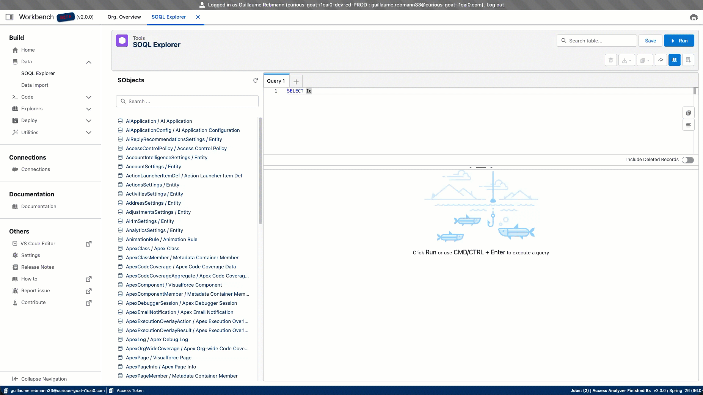

# Workbench

> The modern replacement for **Salesforce Workbench** and **Benchpress**

Latest release: **v2.0.5**

Workbench is a Salesforce administration toolkit that embeds directly into your browser — bringing an overlay panel, a VS Code editor, a full metadata explorer, a SOQL editor, and an AI agent capable of controlling your browser, all from a single Chrome extension.

<div align="center">

</div>

---

## What You Get

<table>
  <tr>
    <td width="55%"></td>
    <td width="45%" valign="middle" align="left" style="padding-left:24px">
      <p><strong>Always at hand</strong></p>
      <h3>Overlay embedded in your Salesforce pages</h3>
      <p>A non-intrusive panel appears on every Salesforce page, giving you instant access to tools, logs, and org data without ever leaving your current context.</p>
    </td>
  </tr>
  <tr><td colspan="2"><br/></td></tr>
  <tr>
    <td width="45%" valign="middle" align="left" style="padding-right:24px">
      <p><strong>Code without context switching</strong></p>
      <h3>VS Code editor running in your local browser</h3>
      <p>A full-featured code editor opens directly inside your browser, powered by the same engine as VS Code. Write, run, and debug Apex without switching windows.</p>
    </td>
    <td width="55%"></td>
  </tr>
  <tr><td colspan="2"><br/></td></tr>
  <tr>
    <td width="55%"></td>
    <td width="45%" valign="middle" align="left" style="padding-left:24px">
      <p><strong>Full visibility into your org</strong></p>
      <h3>Full workbench to interact and explore metadata</h3>
      <p>Browse every object, field, permission set, and metadata component. Run SOQL, compare records, push changes, and manage your org from one focused interface.</p>
    </td>
  </tr>
  <tr><td colspan="2"><br/></td></tr>
  <tr>
    <td width="45%" valign="middle" align="left" style="padding-right:24px">
      <p><strong>Query with confidence</strong></p>
      <h3>Modern SOQL editor built for Salesforce</h3>
      <p>Browse every SObject, write SOQL with autocomplete, and see results instantly. A focused query interface designed to replace the old Workbench query tool.</p>
    </td>
    <td width="55%"></td>
  </tr>
  <tr><td colspan="2"><br/></td></tr>
  <tr>
    <td width="55%"></td>
    <td width="45%" valign="middle" align="left" style="padding-left:24px">
      <p><strong>AI that actually does work</strong></p>
      <h3>Powerful AI agent capable of controlling your browser</h3>
      <p>The AI agent doesn't just answer questions — it takes actions. Navigate Salesforce pages, fill forms, run queries, and complete multi-step org tasks autonomously.</p>
    </td>
  </tr>
</table>

---

## More Screenshots

<table>
  <tr>
    <td align="center" width="33%"><br/><sub>Org Management</sub></td>
    <td align="center" width="33%"><br/><sub>Side Panel</sub></td>
    <td align="center" width="33%"><br/><sub>Quick Record Edit</sub></td>
  </tr>
</table>

<div align="center">
  
  <br/><sub><em>Desktop App</em></sub>
</div>

---

## Available Platforms

| Platform                              | Status            | Link                                                                                                                |
| ------------------------------------- | ----------------- | ------------------------------------------------------------------------------------------------------------------- |
| **Web Extension**                     | Recommended       | [Add to Chrome](https://chromewebstore.google.com/detail/salesforce-toolkit/konbmllgicfccombdckckakhnmejjoei?hl=en) |
| **Desktop** (macOS / Windows / Linux) | Release artifacts | GitHub Releases                                                                                                     |

---

## Repository Layout

```
packages/lwc/app              Main LWC application modules
packages/lwc/extension    LWC modules specific to extension surfaces
packages/server               Dev/prod backend server modules plus LWR assets/layouts/hooks/content
packages/extension            Chrome extension entry points and manifest template
packages/lwc/shared/modules       Shared cross-target modules (shared/*)
packages/workers/src          Worker source files
vendor-bundles       Vendor build wrappers (OpenAI/just-bash)
tools/build                   Rollup configs
tools/scripts                 Utility scripts and generators
assets                        Shared repository assets (images, skills, data, docs/refactor notes)
apps/ui                       Landing page and welcome app (React + Vite)
dist                          Build outputs (dist/web, dist/extension)
```

---

## Prerequisites

- Node.js `22.14` (matches `package.json` engines)
- npm

---

## Setup

```sh
git clone https://github.com/grebmann1/workbench.git
cd workbench
npm install
```

### Salesforce Connected App

The app authenticates with Salesforce via OAuth 2.0. You need a **Connected App** in your Salesforce org to obtain a `CLIENT_ID` and `CLIENT_SECRET`.

1. In Salesforce Setup, go to **App Manager** → **New Connected App**.
2. Enable **OAuth Settings** and set the **Callback URL** to your local redirect URI (e.g. `http://localhost:3000/oauth/callback`).
3. Add the following **OAuth Scopes**:
    - `Full access (full)` — or at minimum `api`, `refresh_token`, `offline_access`
4. Save and copy the **Consumer Key** (`CLIENT_ID`) and **Consumer Secret** (`CLIENT_SECRET`).

> Connected App credentials may take a few minutes to activate in Salesforce after creation.

### Environment Variables

Create a `.env` file in the project root:

```sh
CLIENT_SECRET='YOUR_CLIENT_SECRET'
CLIENT_ID='YOUR_CLIENT_ID'
```

Optional vars:

| Variable       | Default | Description                                                            |
| -------------- | ------- | ---------------------------------------------------------------------- |
| `PORT`         | `3000`  | Server port                                                            |
| `REDIRECT_URI` | —       | OAuth redirect URI (must match the Callback URL in your Connected App) |
| `DOC_VERSION`  | —       | Documentation version                                                  |
| `CHROME_ID`    | —       | Chrome extension ID                                                    |
| `PROXY_URL`    | —       | Proxy URL                                                              |

---

## Common Commands

### Web App

```sh
# Dev server
npm run start:dev:web

# Production build
npm run build:web

# Production server
npm run start:prod:server

# Build and run production
npm run start:prod:web
```

### Desktop App

```sh
# Build the desktop package
npm run build:desktop

# Start the desktop app against an already-running local web server
npm run start:dev:desktop

# Start both the local web server and the desktop app together
npm run start:dev:desktop:all

# Open the desktop app through the launcher CLI
npm run desktop:open
```

### Chrome Extension

```sh
# Dev (main + sandbox watch + local serve)
npm run start:dev:extension

# Production build (extension + workers)
npm run build:prod:extension

# Main-only build
npm run build:extension:main
```

### Vendor Bundles

Some features depend on pre-built vendor bundles (just-bash). These bundles are not committed and must be generated before building the extension:

```sh
# Build all vendor bundles
npm run build:vendor

# Build individual bundles
npm run build:vendor:just-bash
```

Run this once after cloning, and again whenever a vendor package is updated.

### Workers

```sh
npm run watch:workers
npm run build:workers
```

### Local MCP Test Server

Use the local MCP server to verify MCP configuration, tool discovery, and tool execution without depending on an external service.

```sh
# Start the local MCP server on http://localhost:3999/mcp
npm run start:test:mcp

# Run an automated MCP smoke test (starts the server on an ephemeral port)
npm run test:mcp
```

To test through the app, open Settings → AI → MCP → Config and paste the sample config from `tools/mcp/basic-mcp.config.json`. Then use Overview → Refresh Tools to discover `echo`, `add_numbers`, and `get_test_context`.

### Quality / Validation

```sh
npm run lint
npm run check
npm run validate
```

---

## Chrome Extension — Local Load

1. Build extension output (`npm run build:dev:extension`).
2. Open `chrome://extensions/`.
3. Enable **Developer mode**.
4. Click **Load unpacked**.
5. Select `dist/extension`.

> The extension build outputs `manifest.json` in `dist/extension` (generated from `manifest.template.json`).

---

## Architecture Notes

- `lwr.config.json` controls routes, module resolution, and static assets for the web app.
- Rollup configs under `tools/build` control extension and worker bundles.
- Vendor browser bundles are generated under `vendor-bundles` and copied into `packages/server/assets/libs`.
- Agent default skill content is generated into `packages/lwc/shared/modules/defaultAgentSkills`.

### HMR Notes

A known LWR issue can break hot reload by dropping the LWC namespace during recompilation. This project auto-applies a patch after install via `npm run postinstall` (`tools/scripts/patch_lwr_hmr_namespace.mjs`).

If hot reload behaves inconsistently, clear cache and restart the dev server:

```sh
rm -rf __lwr_cache__
npm run start:dev:web
```

---

## Where To Add Code

| Area                                     | Location                                                      |
| ---------------------------------------- | ------------------------------------------------------------- |
| New app-level pages / features           | `packages/lwc/main/pages` and `packages/lwc/main/application` |
| Shared LWC UI shell elements             | `packages/lwc/main/component`                                 |
| Extension-only components                | `packages/lwc/extension`                                      |
| Cross-target reusable modules            | `packages/lwc/shared/modules`                                 |
| Server hooks / routes / content / layout | `packages/server`                                             |

---

## Roadmap

- Continue improving code analyzer and metadata tooling
- Expand data/object assignment analysis
- Improve extension localhost and debugging workflows
- Incrementally improve shared module boundaries and package ergonomics
- Continue hardening desktop distribution for macOS, Windows, and Linux

---

## Contribution

Contributions are welcome. Please open issues or pull requests for improvements, fixes, and new tooling modules.

---

## Open Source Acknowledgments

- [LWC SOQL Builder](https://github.com/lwc-soql-builder/lwc-soql-builder)
- [Salesforce Inspector Reloaded](https://github.com/tprouvot/Salesforce-Inspector-reloaded)
- [Apex Log Analyzer](https://github.com/certinia/debug-log-analyzer) — blazing-fast Salesforce Apex debug log analyzer for VS Code, with flame charts, SOQL/DML analysis, and Apex insights

---

## License

MIT
